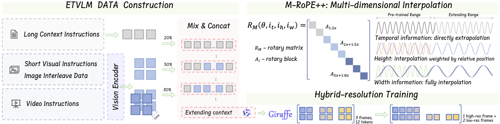

# GIRAFFE: Design Choices for Extending the Context Length of Visual Language Models

<p align="center">
        🤗 <a href="https://huggingface.co/MMInstruction/Giraffe">Hugging Face</a>&nbsp&nbsp | &nbsp&nbsp 📑 <a href="https://arxiv.org/pdf/2409.12191">Paper</a> &nbsp&nbsp  </a>
</p>

## Highlights
* We investigate different design choices to extend the context window of existing VLMs to 128K while maintaining comparable performance on short visual tasks. 
* We conduct comprehensive analysis on decision-making process to validate the effective of our recipes. Technically, M-RoPE++ and hybrid-resolution training methods are newly proposed by us to enhance model performance during training and inference.
* On existing long VLM benchmarks, GIRAFFE achieves state-of-the-art performance among similar scale open-sourced long VLMs and is competitive to commercial models.
<p align="center">
    
</p>


## Installation

Our model extends [Qwen2-VL](https://github.com/QwenLM/Qwen2-VL). For detailed information about the base model, please refer to their repository.

Install the required dependencies:

```bash
pip install git+https://github.com/huggingface/transformers@21fac7abba2a37fae86106f87fcf9974fd1e3830 accelerate
pip install qwen-vl-utils[decord]
```

## Quick Start


To enable M-ROPE++ and hybrid-resolution features, you have two options:

### Option 1: Direct File Replacement
Replace the following files in your local installation:
- Replace `models/modeling_qwen2_vl.py` in your local transformers and qwen-vl-utils with our `models/vision_process.py`

### Option 2: Monkey Patch
Import our patch file before using the model:
* for mrope++
```python
from mrope_plus_monkey_patch import enable_mrope_plus

# Enable mRoPE++
enable_mrope_plus()

from transformers import Qwen2VLForConditionalGeneration, AutoTokenizer, AutoProcessor
```

* for hybrid-resolution
```python

from hybrid_res_monkey_patch import enable_hybrid_resolution
enable_hybrid_resolution()
from qwen_vl_utils import process_vision_info
```
## Citation
If you find our work useful, please cite:

```BibTeX

```


